# "Baba Is You" Game

In the group project of **Digital Logic Design**,  programmed the replica game “Baba Is You” on VGPA based on Verilog. 

### [What is "`Baba Is You`"?](https://store.steampowered.com/app/736260/Baba_Is_You/)

视频

Baba is You is an independent puzzle game with subversive creativity. The core method of the game is to move the hero Baba to change the combination of characters on the map, thereby changing the rules of the game, turning the impossible into the possible, and achieving the conditions for victory.

The version of the game on the Steam platform is very mature, with many levels and rich interfaces. In the course design, our team independently designed the "Baba is you" game based on VGPA (Field－Programmable Gate Array). It is displayed on the SWORD development board integrated by Zhejiang University. We designed 11 levels, and the maps were developed independently. The rules and playing methods of the game have not changed, so logical judgment is a major difficulty in the game design process. Finally, the work was completed using RAM, ROM, and VRAM to store and change maps.

### [What is `VGPA`?](https://en.wikipedia.org/wiki/Field-programmable_gate_array)

### Design & Development Environment

- ###### Experimental platform

  `Xilinx Spartan-3`

- ###### Development Environment

  `Xilinx ISE`

- ###### Hardware Description Language

  `Verilog`

### Design Content

- ###### Materials Gathering

Collect the original game's materials (including text and object pictures).


- ###### Materials Storage

Scale the image size to the size required by our game, generate the corresponding .coe file through Matlab code, and generate RAM and ROM cores accordingly.

- ###### Models Design

  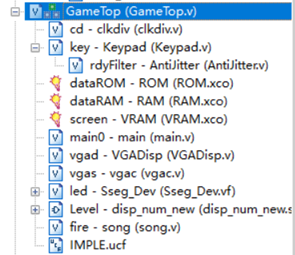

  - ###### Clock Divider -- clkdiv

    ```verilog
    module clkdiv(
        input clk,
        input rst,
        output reg[31:0] clkdiv
        );
    	
    	always @ (posedge clk or posedge rst) begin
    		if (rst) clkdiv <= 0;
    		else clkdiv <= clkdiv + 1'b1;
    	end
    
    endmodule
    ```

  - ###### Input Module -- Keypad 

    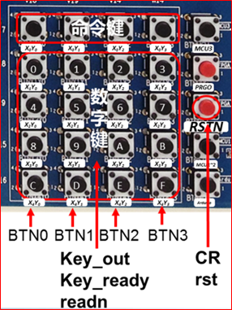

    ```verilog
    module Keypad(
    	input clk,
    	inout [3:0] keyX,
    	inout [4:0] keyY,
    	output reg [4:0] keyCode,
    	output keyReady
    );
    	
    	reg state = 1'b0;
    	reg [3:0] keyLineX;
    	reg [4:0] keyLineY;
    	assign keyX = state? 4'h0: 4'bzzzz;
    	assign keyY = state? 5'bzzzzz: 5'h0;
    	
    	always @ (posedge clk)
    	begin
    		if(state)
    			keyLineY <= keyY;
    		else
    			keyLineX <= keyX;
    		state <= ~state;
    	end
    	
    	wire ready_raw1 = (keyLineX == 4'b1110) | (keyLineX == 4'b1101) | (keyLineX == 4'b1011) | (keyLineX == 4'b0111);
    	wire ready_raw2 = (keyLineY == 5'b11110) | (keyLineY == 5'b11101) | (keyLineY == 5'b11011) | (keyLineY == 5'b10111) | (keyLineY == 5'b01111);
    	wire ready_raw = ready_raw1 & ready_raw2;
    	
    	always @*
    	begin
    		case(keyLineX)
    		4'b1110: keyCode[1:0] <= 2'h0;
    		4'b1101: keyCode[1:0] <= 2'h1;
    		4'b1011: keyCode[1:0] <= 2'h2;
    		default: keyCode[1:0] <= 2'h3;
    		endcase
    		case(keyLineY)
    		5'b11110: keyCode[4:2] <= 3'h0;
    		5'b11101: keyCode[4:2] <= 3'h1;
    		5'b11011: keyCode[4:2] <= 3'h2;
    		5'b10111: keyCode[4:2] <= 3'h3;
    		5'b01111: keyCode[4:2] <= 3'h4;
    		default: keyCode[4:2] <= 3'h7;
    		endcase
    	end
    	
    	AntiJitter #(4) rdyFilter(.clk(clk), .I(ready_raw), .O(keyReady));
    	
    endmodule
    ```

  - ###### AntiJitter

    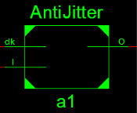

    ```verilog
    module AntiJitter(
    	input clk, input I, output reg O
    );
    
    	parameter WIDTH = 20;
    	reg [WIDTH-1:0] cnt = 0;
    
    	always @ (posedge clk)
    	begin
    		if(I)
    		begin
    			if(&cnt)
    				O <= 1'b1;
    			else
    				cnt <= cnt + 1'b1;
    		end
    		else
    		begin
    			if(|cnt)
    				cnt <= cnt - 1'b1;
    			else
    				O <= 1'b0;
    		end
    	end
    endmodule
    ```

- ###### Main Program -- Finite State Machine

  - ho: Standby
  - h1: Scan all grids
  - h2: Get the information of elements in the grid
  - h3、h23: Get the element attribute in the grid
  - h4: Prepare to move
  - h5: Read the next element
  - h6: Check the attributes of the next grid
  - h7、h8: Realize moving and pushing of the character "Baba", and update map information
  - h9~hc: Judge whether to update the initial grid
  - h10~h13: Update the level and write the initial map
  - hf0~hf9: Change element attributes based on new map information
  - hfa: Update map display

- ###### Nixie Tube

```verilog
Sseg_Dev led(.clk(clk),.rst(1'b0),.Start(clkdiv[20]),.flash(1),
	.Hexs({level, 8'b0000_0000, 3'b000, keyCode[4],3'b000, keyCode[3], 3'b000,keyCode[2],3'b000, keyCode[1],3'b000, keyCode[0]}),.point(8'b00000000),.LES(8'b00000000),
	.seg_clk(SEGLED_CLK),.seg_clrn(SEGLED_CLR),
.seg_sout(SEGLED_DO),.SEG_PEN(SEGLED_PEN));
```

The seven segment nixie tube first converts the digital information into seven segment code through the seven segment code digital decoder, and then uses the image decoder to convert the binary digital information into image information, which is output to the nixie tube.

The left digit displays the current level number, and the right five digits display the KeyCode of the array keyboard.

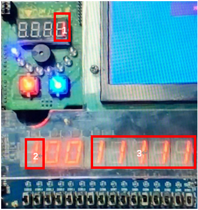

- ###### Simulation Test

Conduct simulation tests on each module to solve potential problems.

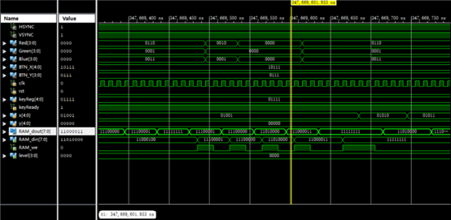

### Game interface & Function Test

- ###### Character Movement

  Initialize the game and the character state before moving is displayed below:

  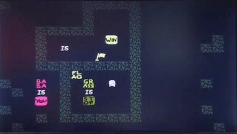

  Use key 6 of the array switch to move the character one space to the left. Note that the character is facing the left:

  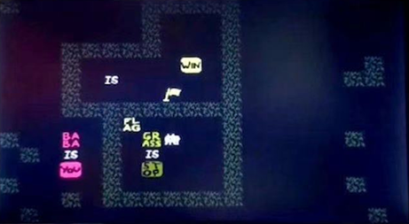

- ###### "Grass is Stop"

  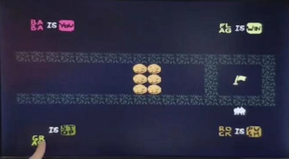

  When "Grass is Stop" is broken, Baba can move across the grass.

  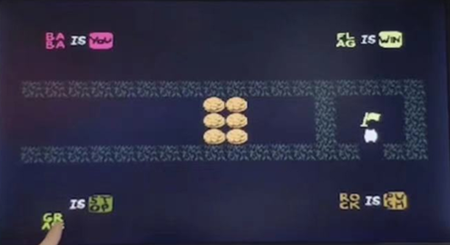

- ###### "Rock is Push"

  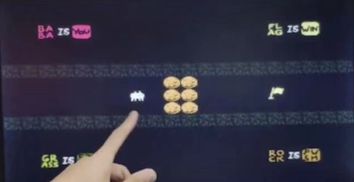

  When "Rock is Push", Baba can push the rock.

  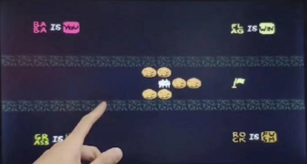

- ###### "Flag is Win"

  When the "flag is win" statement is not destroyed, the character can touch the flag to win.

  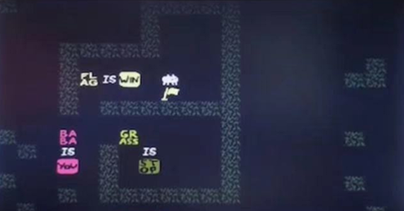

- ###### You Win!

  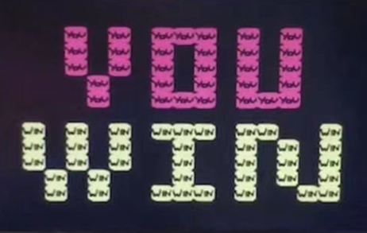

### Group Member

###### Jiajun Chen

###### Haoyi Duan

###### Haolong Chen

### [Document in Chinese](https://github.com/haoyi-duan/Baba-is-You/blob/main/BABA%20is%20you%E8%AE%BE%E8%AE%A1%E6%8A%A5%E5%91%8A.docx)
